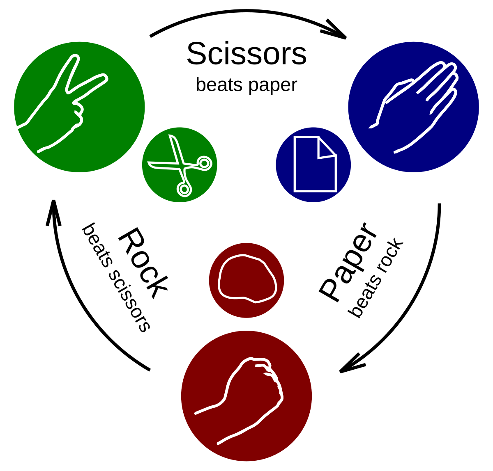

# Rock Paper Scissors Game

## About this project
This project serves as a practical exercise in fundamental programming and version control concepts. It focuses on mastering conditional logic with if statements, implementing case-switch structures for streamlined decision-making, and applying Git commands to successfully upload a local repository onto GitHub.

## How this game work
The user begins by selecting one of the following options:
- 1 for Rock
- 2 for Paper
- 3 for Scissors
- q to quit the game

Once the selection is made, the program randomly chooses a number between 1 and 3 to represent its move. The winner is determined based on the following rules:
- Rock (1) beats Scissors (3)
- Paper (2) beats Rock (1)
- Scissors (3) beats Paper (2)

## Further plans for this project
This project has reached its final version and will not be developed further. However, feedback and suggestions for improving the code are always welcome! If you have advice on optimizing performance, refining logic, or enhancing readability, it would be greatly appreciated.
Thank you for your time and input! 